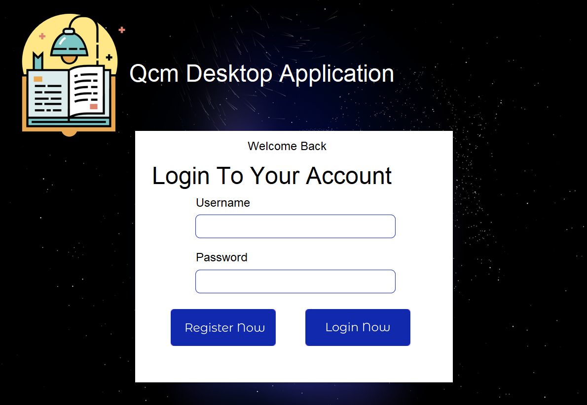
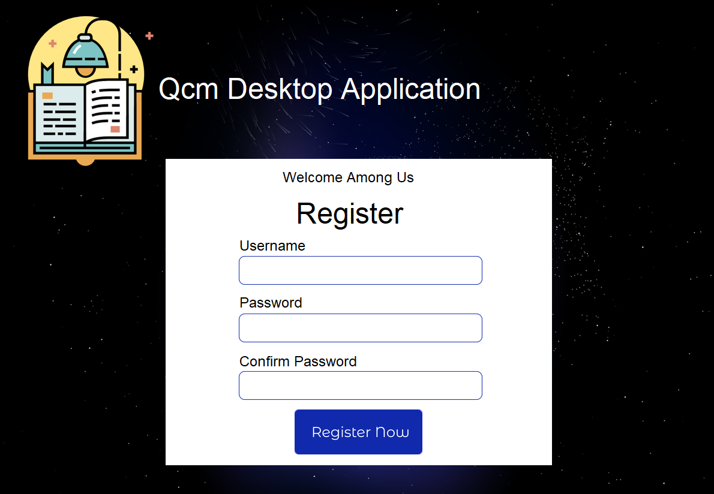

# QCM-Application
QCM-Application est une application Python permettant de gérer des questionnaires à choix multiples (QCM). Elle offre des fonctionnalités telles que l'inscription et la connexion des utilisateurs, la gestion des questions, ainsi que l'historique des réponses.

Fonctionnalités
Inscription et Connexion : Les utilisateurs peuvent créer un compte et se connecter pour accéder à l'application.
Gestion des Questions : Ajout, modification et suppression de questions dans la base de données.
Historique des Réponses : Suivi des réponses des utilisateurs avec possibilité d'exporter les résultats.
Structure du Projet
Le projet est structuré comme suit :

QCM-Application/
├── gui/
│   ├── ...  # Fichiers relatifs à l'interface graphique
├── __pycache__/
│   ├── ...  # Fichiers cache générés par Python
├── Login.json  # Données de connexion des utilisateurs
├── LoginRegister.py  # Gestion de l'inscription et de la connexion
├── Questions.json  # Base de données des questions
├── Rapport.pdf  # Rapport détaillant le projet
├── run.py  # Script principal pour lancer l'application
├── sifi_Physics_history.csv  # Historique des réponses en format CSV
├── sifi_Physics_history.txt  # Historique des réponses en format texte
Prérequis
Python 3.x
Bibliothèques Python nécessaires (listées dans requirements.txt si disponible)
Installation
Clonez le dépôt :

git clone https://github.com/SIFITarekMazigh/QCM-Application.git

Accédez au répertoire du projet :
cd QCM-Application

Installez les dépendances requises :

pip install -r requirements.txt
Utilisation

Pour lancer l'application (console), exécutez le script run.py :
python run.py

pour lancer l' interface graphique : 
python gui/gui.py

